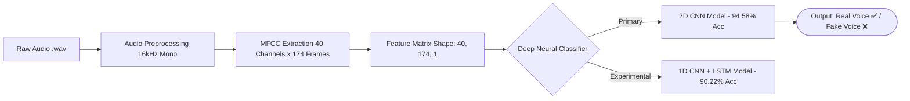

# 🎙️ DeepFake Voice Detection System

[](https://www.python.org/)
[](https://www.tensorflow.org/)
[](https://librosa.org/)
[](LICENSE)

An end-to-end Deep Learning & Audio Signal Processing system designed to detect **AI-generated synthetic voices** and **Retrieval-based Voice Conversion (RVC)** spoofing attacks.

---

## 🌟 Architecture Overview



---

## 📊 Key Highlights & Benchmark Results

Evaluated on **4,634 unseen test audio samples** across **69,300+ total dataset samples**:

| Metric | 2D CNN Model (Primary) | 1D CNN + LSTM Hybrid Model |
| :--- | :---: | :---: |
| **Accuracy** | **94.58%** 🌟 | **90.22%** |
| **Precision** | **97.11%** | **92.09%** |
| **Recall** | **92.15%** | **88.48%** |
| **F1-Score** | **94.57%** | **90.25%** |

* **Low False Positives:** Precision of **97.11%** ensures authentic human voices are rarely misclassified as fake.
* **Pre-Computed Cache:** Feature extraction arrays (`.npy`) pre-saved to avoid 2+ hours of librosa extraction during retraining.

---

## 📁 Repository Structure

```text
├── predict.py                          # GUI Desktop application for live inference
├── MFCC+CNN.ipynb                      # 2D CNN training, feature extraction & evaluation
├── CNN+LSTM.ipynb                      # Hybrid 1D CNN + LSTM temporal model notebook
├── test.ipynb                          # Quick interactive inference notebook
├── deepfake_voice_model_cnn.keras      # Trained 2D CNN weights (94.58% accuracy)
├── cnn_lstm_deepfake_model.keras       # Trained 1D CNN + LSTM weights
├── Voice_Spoofing_Detection_Based_...  # Baseline research paper (PDF)
├── .gitignore                          # Excludes large dataset files (>1.5 GB) from git
└── README.md                           # Documentation
```

---

## 💻 Quick Start & Running Inference

### 1. Environment Setup

Clone the repository and install required packages:

```bash
# Clone repository
git clone https://github.com/YOUR-USERNAME/deepfake-voice-detection.git
cd deepfake-voice-detection

# Install dependencies
pip install numpy librosa tensorflow matplotlib seaborn
```

### 2. Run GUI Audio Classifier (`predict.py`)

Run the desktop audio classifier:

```bash
python predict.py
```

1. A popup window will prompt you to pick any `.wav` audio file.
2. The script extracts **40 MFCC features** on-the-fly.
3. Performs prediction using `deepfake_voice_model_cnn.keras` and prints the outcome with confidence scores.

---

## 🔬 Dataset & Feature Engineering

* **Audio Sample Rate:** 16,000 Hz (`sr=16000`), converted to mono channel.
* **Silence Removal & Normalization:** Signal amplitude normalized and silent padded segments removed.
* **MFCC Configuration:** 40 coefficients extracted per frame.
* **Time Frame Padding:** Standardized frame length `max_pad_len = 174` (~5-second max duration).
* **Input Tensor Shape:** `(40, 174, 1)` for 2D CNN input.

---


## 📄 Reference

* Baseline Paper: `Voice_Spoofing_Detection_Based_on_the_RVC_Deep_Learning_CNN_Model.pdf`

---
